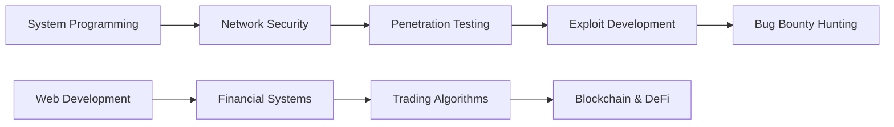

<div align="center">

# 👾 Welcome, I'm Yanis

### 🔐 Cybersecurity Enthusiast | 💻 Full-Stack Developer | 🎓 Epitech Student

[](mailto:yanis.asselman@epitech.eu)
[](https://tryhackme.com)
[](https://hackthebox.com)


</div>

```ascii
╔═══════════════════════════════════════════════════════════════╗
║  🚀 Transforming ideas into code, one commit at a time       ║
╚═══════════════════════════════════════════════════════════════╝
```

## 🎯 About Me

```python
class Developer:
    def __init__(self):
        self.name = "Yanis Asselman"
        self.role = "Student Developer"
        self.location = "France 🇫🇷"
        self.education = "Epitech"
        self.current_focus = "Cybersecurity & Financial Software"
        self.interests = ["Hacking", "Security", "Finance Tech", "Open Source"]
    
    def say_hi(self):
        print("Thanks for dropping by! Let's build something amazing together.")

me = Developer()
me.say_hi()
```

---

## 🔭 What I'm Up To

- 💼 Building a **Financial Market Software** - automating trading strategies
- 🛡️ Sharpening my **cybersecurity skills** on TryHackMe & HackTheBox
- 🌱 Learning **penetration testing**, **network security**, and **exploit development**
- 🚀 Exploring **blockchain** and **DeFi** technologies
- 📚 Always diving deeper into **system programming** and **low-level security**

---

## 🛠️ Tech Arsenal

<div align="center">

### 💻 Languages


### 🎨 Frontend & Mobile


### ⚙️ Backend & Databases


### 🔧 DevOps & Tools


### 🔐 Cybersecurity


</div>

---

## 📊 GitHub Statistics

<div align="center">
  
  
</div>

<div align="center">
  
</div>

<div align="center">
  
</div>

---

## 🏆 GitHub Trophies

<div align="center">
  
</div>

---

## 🎯 Current Learning Path



---

## 💡 Featured Projects

<div align="center">

### 🔥 [Financial Market Software](lien-vers-repo)
**Real-time trading platform** with automated strategies  
`Node.js` `TypeScript` `PostgreSQL` `Docker`

### 🛡️ [Security Tools Collection](lien-vers-repo)
**Custom pentesting tools** and scripts  
`Python` `Bash` `C`

### 📱 [Mobile App](lien-vers-repo)
**Cross-platform application** with Flutter  
`Dart` `Flutter` `Firebase`

</div>

---

## 🎓 Certifications & Achievements

- 🏅 **TryHackMe** - Active learner in cybersecurity
- 🎯 **HackTheBox** - Penetration testing practice
- 🎓 **Epitech** - Software Engineering Student
- 💻 **Open Source Contributor**

---

## 📈 Contribution Graph

<div align="center">
  
</div>

---

## 💬 Random Dev Quote

<div align="center">
  
</div>

---

## 🤝 Let's Connect!

<div align="center">

**I'm always open to interesting conversations and collaboration opportunities!**

[](mailto:yanis.asselman@epitech.eu)

```
💡 "Security is not a product, but a process." - Bruce Schneier
```

### 🌟 If you like my work, feel free to ⭐ my repositories!

**Thanks for visiting! 🚀**

</div>
